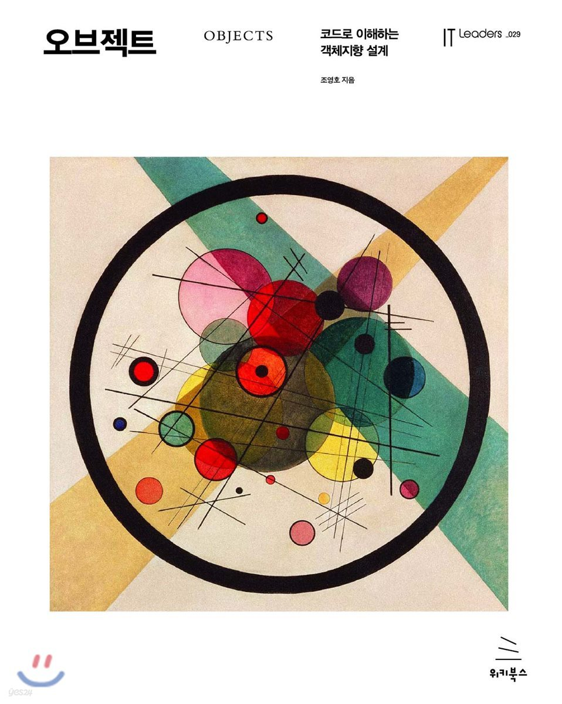

# 오브젝트: 코드로 이해하는 객체지향 설계

💡 저자 : 조영호

책을 읽고 정리한 내용을 공유 합니다!

현재는 노션으로 정리 중.. 다 읽고 md 파일로 공유하고 총평까지 남기겠습니다!🕺🏻

현재 5장까지 읽은 소감,, 이 책은 개발자라면 무조건 필독하기. 어려워도 읽기!

https://seohyeonspace.notion.site/71f83cc636c64280b5066608cac59194

